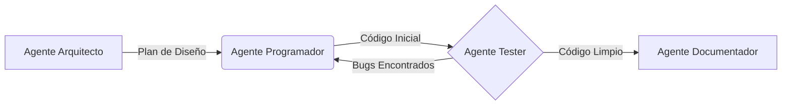

# 4.2 - Cadenas de Agentes (Chaining)

## 🎯 Objetivo

Aprender a conectar múltiples Agentes Inteligentes de forma secuencial, donde el resultado de uno se convierte en el insumo (input) del siguiente, para resolver tareas altamente complejas que ningún agente individual podría manejar por sí solo.

---

## 🔗 ¿Qué es una Cadena de Agentes?

En la automatización con IA, una **cadena (chain)** es un patrón de diseño donde varios agentes colaboran pasando información de uno a otro. Cada agente es un **especialista** que realiza una tarea concreta y luego transfiere su resultado al siguiente eslabón de la cadena.

Imagina una línea de ensamblaje en una fábrica de autos. El trabajador de chasis no ensambla el motor ni pinta el vehículo; simplemente termina su tarea y se la pasa al siguiente especialista. La calidad del auto final depende de que cada especialista haga su parte a la perfección.

### 🤔 ¿Por qué NO usar un solo agente para todo?

Un único agente que intenta hacer todo sufre de varios problemas:

| Problema | Descripción |
|---|---|
| **Distracción cognitiva** | El modelo "piensa" en demasiadas cosas a la vez, perdiendo precisión |
| **Sesgos de confirmación** | El mismo agente que crea algo también lo revisa, tendiendo a ignorar sus propios errores |
| **Contexto contaminado** | El proceso de "borrador" ensucia la ventana de contexto del resultado final |
| **Difícil de depurar** | Si falla, no sabes en qué etapa ocurrió el error |
| **No escalable** | Para mejorarlo, debes reescribir todo |

### ✅ ¿Por qué SÍ encadenar agentes?

1. **Calidad superior:** Un agente que solo hace "Review" siempre será más crítico que el agente que escribió el contenido originalmente. La separación de responsabilidades elimina el sesgo.
2. **Contexto limpio:** El agente final recibe únicamente el output pulido del anterior, sin el "ruido" ni los pasos intermedios que usó el primer agente.
3. **Escalabilidad:** Puedes reemplazar el "Agente Redactor" por una versión mejorada sin afectar al "Agente Traductor" que va después.
4. **Depuración sencilla:** Si la cadena falla, puedes ver exactamente qué agente produjo el output incorrecto.
5. **Especialización profunda:** Cada agente puede tener un prompt perfectamente optimizado para UNA sola tarea.

---

## 🏗️ Anatomía de una Cadena Típica

Una cadena clásica suele seguir el patrón **Planificación → Ejecución → Revisión**.

### Ejemplo: Cadena de Creación de Software



1. **Agente Arquitecto**: Recibe el prompt del humano. Diseña la estructura de carpetas y el diagrama UML. Pasa su resultado.
2. **Agente Programador**: Recibe la estructura. Escribe el código en Python.
3. **Agente Tester**: Revisa el código. Si falla, hace un bucle de vuelta al programador. Si pasa, lo envía adelante.
4. **Agente Documentador**: Recibe el código limpio y genera un `README.md`.

### Tipos de flujo en una cadena

```
Flujo Lineal (más común):
A → B → C → D → Output

Flujo con Bucle de Retroalimentación:
A → B → C → (¿OK?) --No--> B
                  --Sí--> D → Output

Flujo con Ramificación:
A → B → ¿Tipo de tarea?
          ├─ Si es X → Agente X → Output
          ├─ Si es Y → Agente Y → Output
          └─ Si es Z → Agente Z → Output
```

---

## 📝 Implementando Cadenas con Archivos Markdown

Cuando trabajamos con orquestadores (como LangChain, AutoGen, CrewAI o sistemas custom), los archivos `.md` de cada agente deben indicar claramente qué formato esperan recibir y qué formato deben entregar para que el acople sea perfecto.

### Agente 1 (El que envía)
En su archivo de configuración, añadimos:

```markdown
## Salida Obligatoria (Output Format)
Debes retornar ÚNICAMENTE un bloque de código JSON con los datos extraídos, sin texto introductorio ni conclusiones.

Ejemplo de salida correcta:
```json
{
  "producto": "Laptop Pro X",
  "precio": 1299.99,
  "disponibilidad": true,
  "categoria": "electronica"
}
```
```

### Agente 2 (El que recibe)
En su archivo de configuración, añadimos:

```markdown
## Entrada Esperada (Input Format)
Recibirás un bloque JSON con datos estructurados de ventas. Tu trabajo es leer esos datos y generar un reporte narrativo en español.

Ejemplo de entrada:
```json
{
  "producto": "Laptop Pro X",
  "precio": 1299.99,
  "disponibilidad": true,
  "categoria": "electronica"
}
```

A partir de este JSON, genera un párrafo descriptivo profesional.
```

---

## 🧪 Ejemplos Completos de Cadenas Reales

### Ejemplo 1: Cadena de Análisis y Reporte de Ventas

**Caso de uso:** El área comercial necesita un reporte semanal automatizado de ventas.

```
Input del Usuario:
"Genera el reporte de ventas de esta semana con los datos del archivo."

Cadena:
[Agente Extractor] → [Agente Analítico] → [Agente Redactor] → [Agente Formateador]
```

**Agente Extractor** (`extractor-ventas.md`):
```markdown
# AGENT: Extractor de Datos de Ventas

## Rol
Eres un especialista en extracción de datos. Tu única tarea es leer el archivo
de ventas crudo y convertirlo en un JSON estructurado y limpio.

## Output Obligatorio
Retorna SOLO el siguiente JSON sin ningún texto adicional:
```json
{
  "semana": "YYYY-WXX",
  "total_ventas": 0.00,
  "num_transacciones": 0,
  "producto_top": "nombre",
  "regiones": [{"nombre": "region", "ventas": 0.00}]
}
```
```

**Agente Analítico** (`analista-ventas.md`):
```markdown
# AGENT: Analista de Tendencias

## Input Esperado
Recibirás un JSON de ventas estructurado del Agente Extractor.

## Tarea
Analiza los datos y genera un JSON de insights con:
- Porcentaje de crecimiento vs semana anterior
- Top 3 productos
- Región con mayor caída
- Alerta si alguna métrica está fuera del rango normal

## Output
```json
{
  "crecimiento_pct": 0.0,
  "alertas": [],
  "top_productos": [],
  "insights": []
}
```
```

---

### Ejemplo 2: Cadena de Generación de Contenido para Blog

```
Input: Tema del artículo ("Beneficios del trabajo remoto")

[Agente Investigador] → [Agente Redactor] → [Agente SEO] → [Agente Editor Final]
      ↓                       ↓                  ↓                  ↓
 Datos y fuentes         Borrador 800w       Título + meta       Artículo pulido
```

Esta cadena es especialmente poderosa porque:
- El **Investigador** no escribe, solo recopila hechos verificables.
- El **Redactor** no investiga, solo crea narrativa fluida.
- El **SEO** no reescribe, solo optimiza palabras clave y metadatos.
- El **Editor** no inventa, solo pule el estilo y la coherencia.

---

### Ejemplo 3: Cadena con Bucle de Calidad (QA Loop)

Este patrón es ideal cuando la calidad es crítica y no puedes permitirte errores.

```
[Agente Generador] → [Agente Validador]
        ↑                    |
        |                    | ¿Validación OK?
        |                    |
        |-- No, hay errores --'
        |
        '-- Sí → [Agente Publicador]
```

**Configuración del Agente Validador:**
```markdown
# AGENT: Validador de Calidad

## Entrada
Recibirás el output del Agente Generador.

## Proceso
1. Verifica que el output cumple TODOS los criterios de calidad
2. Puntúa de 0 a 100
3. Si la puntuación es < 85, devuelve el output al Generador con feedback específico
4. Si la puntuación es >= 85, aprueba y pasa al Publicador

## Output
```json
{
  "puntuacion": 0,
  "aprobado": false,
  "feedback": "Lista de mejoras específicas necesarias",
  "iteracion_actual": 1,
  "max_iteraciones": 3
}
```

## IMPORTANTE
- Nunca superes las 3 iteraciones (max_iterations: 3)
- Si llegas a 3 iteraciones sin aprobar, pasa con puntuación actual y una nota de advertencia
```

---

## ⚙️ Protocolo de Comunicación Entre Agentes

Para que la cadena funcione sin "teléfono roto", cada agente debe usar un protocolo estándar de entrada/salida.

### Estructura JSON Recomendada

```json
{
  "task_id": "tarea_001",
  "version": "1.0",
  "from_agent": "agente-redactor",
  "to_agent": "agente-editor",
  "timestamp": "2026-05-31T10:00:00Z",
  "context": {
    "query_original": "Escribe un artículo sobre IA",
    "instrucciones_adicionales": "Tono formal, máximo 800 palabras"
  },
  "payload": {
    "contenido": "El texto generado va aquí...",
    "metadata": {
      "palabras": 750,
      "idioma": "es"
    }
  },
  "estado": "completado",
  "notas_para_siguiente": "El artículo necesita revisión de título SEO"
}
```

---

## ⚠️ Retos Comunes en el Chaining

### 1. El Teléfono Roto (Degradación del Contexto)
Si el Agente 1 omite un dato crucial, el Agente 3 nunca lo sabrá y fallará silenciosamente o producirá un output incorrecto.

**Solución:** Incluye siempre el `query_original` del usuario en el JSON que se pasa entre agentes. Así cualquier agente puede consultar el objetivo original si lo necesita.

```markdown
## Regla de Oro
Todo agente de la cadena DEBE recibir y repasar el "query_original" del usuario
para no perder de vista el objetivo final.
```

### 2. Ciclos Infinitos (Infinite Loops)
Cuando dos agentes están encadenados en modo de retroalimentación (Crítico → Redactor → Crítico), pueden quedarse debatiendo por siempre.

**Solución:** Establece un límite máximo de iteraciones en el archivo de configuración:
```markdown
## Control de Iteraciones
- max_iterations: 3
- Si se alcanza el límite, retornar el mejor resultado obtenido con una nota de advertencia
- Nunca bloquear el flujo completo
```

### 3. Formato Incompatible (Handshake Fallido)
El Agente 1 entrega un formato que el Agente 2 no espera.

**Solución:** Define un "contrato de interfaz" claro en ambos archivos `.md`:
```markdown
# Agente A - Output Format
Siempre retornar JSON válido con las claves: {producto, precio, stock}

# Agente B - Input Format
Esperando JSON con las claves obligatorias: {producto, precio, stock}
Si falta alguna clave, generar un error descriptivo y detener el proceso.
```

### 4. Pérdida de Desempeño en Cadenas Largas
Las cadenas muy largas (más de 5 agentes) pueden volverse lentas y costosas.

**Soluciones:**
- Usa agentes en paralelo cuando las tareas sean independientes entre sí.
- Considera si dos agentes consecutivos pueden fusionarse en uno sin perder calidad.
- Cachea los resultados de agentes "lentos" cuando el input no cambia.

---

## 🚀 Próximos Pasos

Dominar las cadenas secuenciales abre la puerta a arquitecturas mucho más robustas. Pero, ¿cómo logramos que durante esta larga cadena el sistema no olvide las preferencias del usuario o el objetivo original de la tarea?

👉 **Siguiente**: [4.3 - Manejo de contexto y memoria](03-contexto-memoria.md)

---

## 💡 Ejercicio Práctico

**Diseña tu propia cadena**:
1. Piensa en un proceso tedioso de tu empresa o de tu vida diaria (ej. Buscar vuelos, comparar precios, planear un viaje, escribir un artículo para un blog).
2. Divídelo en 3-4 "estaciones" de trabajo.
3. Ponle un nombre y rol a cada agente.
4. Define:
   - Qué entrega el Agente 1 al Agente 2
   - Qué entrega el Agente 2 al Agente 3
   - Cuál es el output final que recibe el usuario
5. Identifica posibles puntos de fallo y cómo los manejarías.

**Plantilla para tu ejercicio:**
```
NOMBRE DE MI CADENA: _______________

Agente 1: [Nombre] - [Rol]
  Input: (lo que recibe del usuario)
  Output: (lo que entrega al siguiente)

Agente 2: [Nombre] - [Rol]
  Input: (lo que recibe del Agente 1)
  Output: (lo que entrega al siguiente)

Agente 3: [Nombre] - [Rol]
  Input: (lo que recibe del Agente 2)
  Output: (resultado final para el usuario)

Posibles fallos y soluciones:
  - Riesgo 1: ___  → Solución: ___
  - Riesgo 2: ___  → Solución: ___
```

---

**Tiempo estimado**: 25 minutos  
**Dificultad**: ⭐⭐⭐ Avanzado
