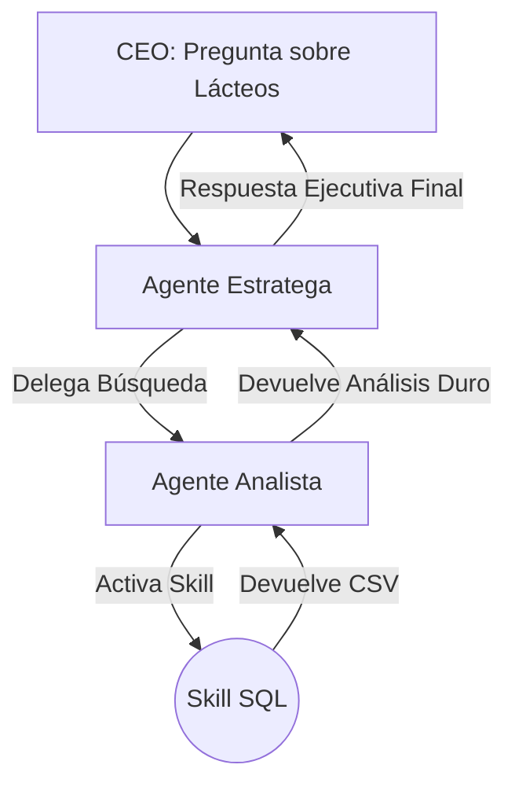

# 7.1 - Diseño del Sistema (Proyecto Final)

## 🎯 Objetivo

Planificar la arquitectura de un **Sistema de Business Intelligence (BI)** compuesto por múltiples agentes y skills antes de escribir una sola línea de código o archivo Markdown.

---

## 🏭 El Caso de Estudio

Somos los arquitectos de IA de una cadena de supermercados. El CEO necesita saber *por qué cayeron las ventas de la categoría "Lácteos" en el último trimestre*.
Podríamos darle esta tarea a un solo bot genérico, pero ya sabemos (gracias al Módulo 3) que se abrumaría, alucinaría o cometería errores matemáticos.

Vamos a dividir el problema usando nuestra metodología.

---

## 🏗️ Arquitectura del Sistema Multi-Agente

Para resolver un problema de Inteligencia de Negocios de punta a punta, diseñaremos 3 entidades.

### 1. Skill_Extractor_SQL.md (El Músculo)
- **Tipo:** Skill puro de automatización.
- **Input:** Una fecha de inicio y una fecha de fin.
- **Proceso:** Extrae datos crudos de ventas de la base de datos de la empresa simulada.
- **Output:** Un archivo CSV crudo (sin formato, sin saludo, solo datos duros).

### 2. Agente_Analista_Datos.md (El Cerebro Matemático)
- **Tipo:** Agente especialista.
- **Personalidad:** Analítico, objetivo, obsesionado con las matemáticas. No opina, solo reporta números.
- **Input:** El CSV generado por el Extractor.
- **Capacidades:** Calcular medias, caídas porcentuales y encontrar el producto con peor desempeño.
- **Output:** Un reporte técnico estructurado con viñetas (Outline).

### 3. Agente_Estratega_Negocios.md (El Comunicador)
- **Tipo:** Agente de alto nivel (C-Level).
- **Personalidad:** Ejecutivo, proactivo, enfocado en soluciones y persuasivo.
- **Input:** El reporte técnico del Analista de Datos.
- **Proceso:** Toma números aburridos y los convierte en una narrativa de negocios (Ej. *"Las ventas cayeron un 12% debido a... Recomiendo lanzar una promoción de 2x1 en Quesos"*).
- **Output:** Un correo formal y pulido dirigido al CEO.

---

## 🔄 El Flujo de Datos (Workflow)

**Nota Arquitectónica:** Observa cómo el Estratega de Negocios NUNCA toca la base de datos SQL directamente. Sus capacidades están restringidas (Guardrails, Módulo 6). El Estratega *delega* al Analista.

---

## 📋 Preparativos antes de Implementar

Antes de pasar a crear los archivos reales en la siguiente lección, debemos definir nuestra **plantilla base**. Usaremos el estándar que hemos aprendido en el curso:

1. `---` (Metadatos YAML)
2. `# Título`
3. `## Personalidad / Propósito`
4. `## Capacidades / Skills Habilitados`
5. `## Reglas Estrictas`
6. `## Output Esperado`

---

## 🚀 Próximos Pasos

La planificación es clave en los sistemas de IA empresariales. Ahora que tenemos el plano de nuestro rascacielos, vamos a construir los cimientos.

👉 **Siguiente**: [7.2 - Implementación Completa](02-implementacion.md)

---

## 💡 Ejercicio Práctico

1. Analiza tu propio puesto de trabajo o industria.
2. Identifica un problema grande o un proceso de reporte mensual que sea tedioso.
3. Dibuja (en papel o mentalmente) un diagrama como el de arriba. ¿Qué agente extraería la información bruta? ¿Quién la procesaría? ¿Quién escribiría el reporte final?

---

**Tiempo estimado**: 20 minutos  
**Dificultad**: ⭐⭐⭐ Avanzado
