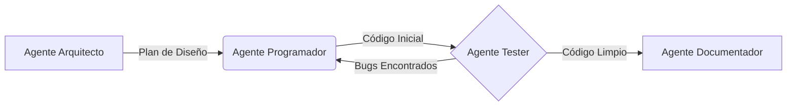

# 4.2 - Cadenas de Agentes (Chaining)

## 🎯 Objetivo

Aprender a conectar múltiples Agentes Inteligentes de forma secuencial, donde el resultado de uno se convierte en el insumo (input) del siguiente, para resolver tareas altamente complejas.

---

## 🔗 ¿Qué es una Cadena de Agentes?

En la automatización con IA, una **cadena (chain)** es un patrón de diseño donde varios agentes colaboran pasando información de uno a otro. 

Imagina una línea de ensamblaje en una fábrica de autos. El trabajador de chasis no ensambla el motor ni pinta el vehículo; simplemente termina su tarea y se la pasa al siguiente especialista.

### ¿Por qué encadenar agentes?
1. **Calidad superior:** Un agente que solo hace "Review" siempre será más crítico que el agente que escribió el contenido originalmente.
2. **Contexto limpio:** El agente final no se distrae con la basura o los pasos intermedios que usó el primer agente.
3. **Escalabilidad:** Puedes reemplazar el "Agente Redactor" por una versión mejorada sin afectar al "Agente Traductor" que va después.

---

## 🏗️ Anatomía de una Cadena Típica

Una cadena clásica suele seguir el patrón **Planificación -> Ejecución -> Revisión**.

### Ejemplo: Cadena de Creación de Software



1. **Agente Arquitecto**: Recibe el prompt del humano. Diseña la estructura de carpetas y el diagrama UML. Pasa su resultado.
2. **Agente Programador**: Recibe la estructura. Escribe el código en Python.
3. **Agente Tester**: Revisa el código. Si falla, hace un bucle de vuelta al programador. Si pasa, lo envía adelante.
4. **Agente Documentador**: Recibe el código limpio y genera un `README.md`.

---

## 📝 Implementando Cadenas con Archivos Markdown

Cuando trabajamos con orquestadores (como LangChain, AutoGen o sistemas custom), los archivos `.md` de cada agente deben indicar claramente qué formato esperan recibir y qué formato deben entregar para que el acople sea perfecto.

### Agente 1 (El que envía)
En su archivo de configuración, añadimos:

```markdown
## Salida Obligatoria (Output Format)
Debes retornar ÚNICAMENTE un bloque de código JSON con los datos extraídos, sin texto introductorio ni conclusiones.
```

### Agente 2 (El que recibe)
En su archivo de configuración, añadimos:

```markdown
## Entrada Esperada (Input Format)
Recibirás un bloque JSON con datos estructurados de ventas. Tu trabajo es leer esos datos y generar un reporte narrativo en español.
```

---

## ⚠️ Retos Comunes en el Chaining

1. **El Teléfono Roto (Degradación del Contexto):** Si el Agente 1 omite un dato crucial, el Agente 3 nunca lo sabrá y fallará. Asegúrate de pasar el input original a lo largo de la cadena si es estrictamente necesario.
2. **Ciclos Infinitos (Infinite Loops):** Cuando dos agentes están encadenados en modo de retroalimentación (Crítico -> Redactor -> Crítico), pueden quedarse debatiendo por siempre. **Solución:** Establece un límite máximo de iteraciones (max_iterations: 3).

---

## 🚀 Próximos Pasos

Dominar las cadenas secuenciales abre la puerta a arquitecturas mucho más robustas. Pero, ¿cómo logramos que durante esta larga cadena el sistema no olvide las preferencias del usuario o el objetivo original de la tarea?

👉 **Siguiente**: [4.3 - Manejo de contexto y memoria](03-contexto-memoria.md)

---

## 💡 Ejercicio Práctico

**Diseña tu propia cadena**:
1. Piensa en un proceso tedioso de tu empresa o de tu vida diaria (ej. Buscar vuelos, comparar precios, planear un viaje, escribir un artículo para un blog).
2. Divídelo en 3 "estaciones" de trabajo.
3. Ponle un nombre y rol a los 3 agentes que harían el trabajo.
4. Define qué entrega el Agente 1 al Agente 2, y el Agente 2 al Agente 3.

---

**Tiempo estimado**: 15 minutos  
**Dificultad**: ⭐⭐⭐ Avanzado
